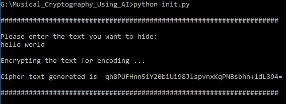
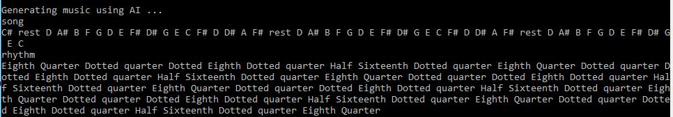
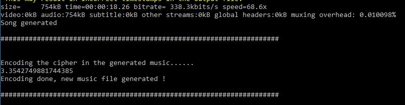
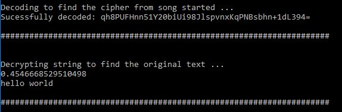

# Musical_Cryptography_Using_AI
A safe and secure way to encrypt and encode message in AI generated music. 

Instructions for running:

1. Install the required libraries
2. Run init.py 

Steps in the algorithm:

1) Plain text is converted to plain text using AES Encryption algorithm.

2) Genetic Algorithm is used to generate a musical piece by evolving itself . The main objective of using Genetic Algorithm is to generate a good music which is less prone to doubts from the attacker. 

3) The cipher text is encoded in the newly generated music and the music is then send to the receiver.

4) Receiver decodes the music and then decrypts the message

